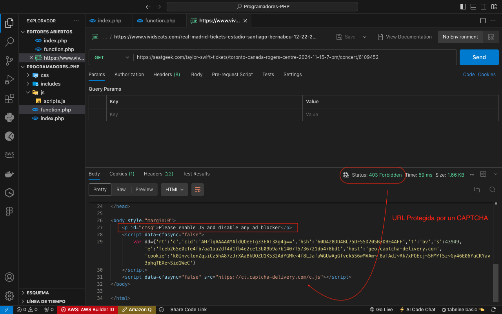
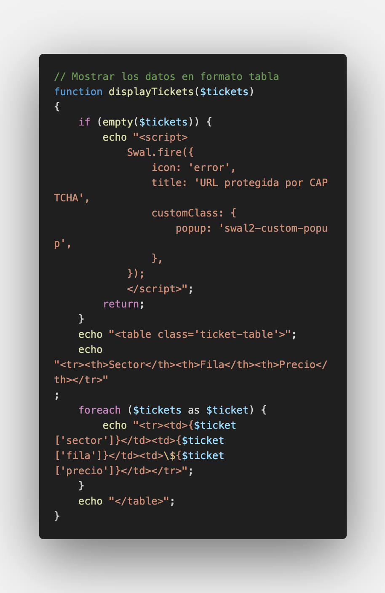
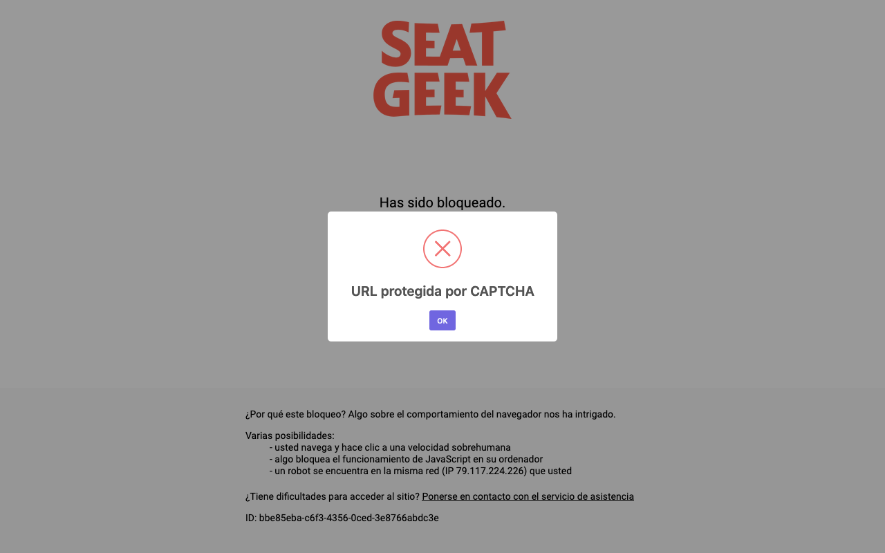
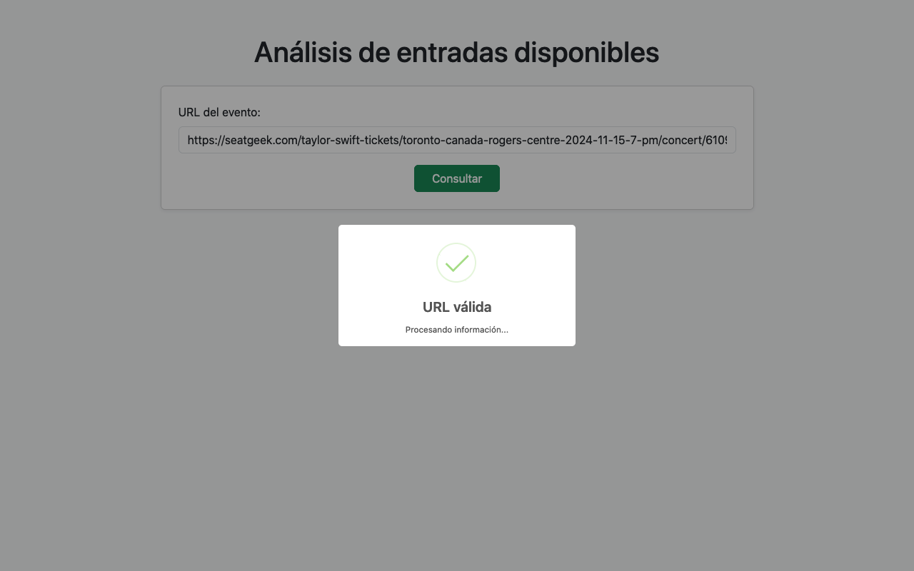

# Prueba Práctica Desarrollador PHP - GlobalExperience

👋 ¡Hola!

A continuación, te presento la solución que desarrollé para el ejercicio práctico en PHP.

## Descripción del Proyecto

Utilicé Postman para realizar una petición **GET** a los enlaces proporcionados con el fin de analizar la estructura de las plataformas y extraer la información requerida.

### URLs Proporcionadas

```bash
https://www.vividseats.com/real-madrid-tickets-estadio-santiago-bernabeu-12-22-2024--sports-soccer/production/5045935
```

```bash
  https://seatgeek.com/taylor-swift-tickets/toronto-canada-rogers-centre-2024-11-15-7-pm/concert/6109452
```

Sin embargo, ambas URLs están protegidas por un CAPTCHA, lo que impide obtener directamente la información. A pesar de esto, he implementado la lógica backend en PHP y una pequeña validación en el frontend con JavaScript para manejar el flujo.

<p align="center">
  
</p>

## Lógica PHP

- **Archivo `index.php`**: Contiene un formulario para ingresar la URL del evento. Tiene una validación básica con JavaScript, y envía la URL a `function.php`.

- **Archivo `function.php`**: Aquí se desarrolla la lógica principal. Se validan las URLs y, utilizando expresiones regulares, se extrae información como el sector, la fila y el precio de los boletos (suponiendo que la respuesta no esté en formato JSON).

El contenido se muestra en una tabla que detalla la información relevante de las entradas: **sector**, **fila** y **precio**.

<p align="center">
  
</p>

### Flujo Principal

- Se verifica si se ha recibido una URL mediante el método **POST**. Si es así, se almacena el valor en la variable `$platform`, que será el resultado de la función **`detectPlatform()`**.

- Dependiendo de la plataforma (**VividSeats** o **SeatGeek**), se llama a la función correspondiente: **`getVividSeatsTickets()`** o **`getSeatGeekTickets()`**. Los resultados se almacenan en la variable `$tickets` y posteriormente se muestran utilizando la función **`displayTickets()`**.

<p align="center">
  
</p>

### Funciones Clave

- **`getUrlContent()`**: Esta función se encarga de obtener el contenido HTML de las páginas web a través de cURL.

> *Nota*: Al hacer un `echo` a la variable `$html`, se observa que las páginas están protegidas por CAPTCHA.

- **Expresiones Regulares**: Utilizo expresiones regulares para extraer información relevante como el sector, fila y precio de las entradas.

- **`displayTickets()`**: Finalmente, esta función muestra los datos en formato de tabla. Si la URL está protegida por CAPTCHA, se muestra una alerta de error.

<p align="center">
  
</p>

<p align="center">
  
</p>

<p align="center">
  
</p>

## Contacto

Cristian Eduardo Castro Vargas  
[Email](cj.94@hotmail.com) | [LinkedIn](https://www.linkedin.com/in/cristian-castro-vargas/) | [Portafolio](https://cristian-castro.com/)
